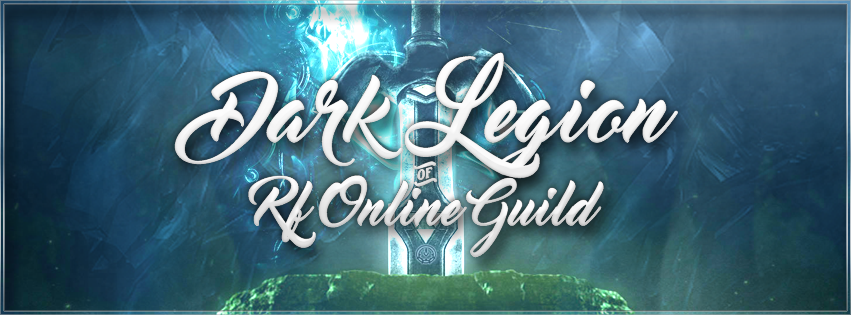

# 👋 Bem-vindo à †Dark·Legion† Guild.

> **Fundada em 2011 por [xLokoOwneD](#xlokoowned)**
>
> Juntos, nossa organização está há {{yearsPassed}} anos escrevendo esta história. De uma presença inquestionável, tornamo-nos relevantes nos cenários [brasileiro, filipino e indonesiano](sobrerf/#cenarios).
>
> Atualmente, seguimos baseados em quatro pilares:
> * Organização
> * Companheirismo
> * Lealdade
> * Determinação
>
> [📖 Saiba mais sobre nossa história](inicio/#historia)

:link: **Todos os links da nossa organização:** [linktr.ee/dlguild](https://linktr.ee/dlguild)

[shadowbox button="🎮 Jogando Atualmente: RF OldTimes - Raça Bellato"]

### 🎮 Servidor Atual: RF OldTimes

- 🌐 **Servidor ativo:** [RF OldTimes](https://linktr.ee/oldtimes)
- 👥 **Players Ativos:** 250+
- 👥 **Informações do servidor, todas no gitbook do mesmo:** [GitBook OldTimes](https://rf-old-times.gitbook.io/rfoldtimes/)
- ⚔️ **Raça da Guilda:** Bellato
- 🏆 **Eventos Ativos:** Leilão de itens, sorteio semanal, divisão de moeda do jogo, ajudamos novos jogadores a upar e se equipar, raid's, eventos semanais, etc.
- 💬 **Comunicação:** Disponibilidade de Discord/WhatsApp para interação dos membros.
- 📜 **Requisitos de entrada:** Respeito, jogo limpo e companheirismo foram sempre nosso diferencial. 
  Recrutamos novos membros regularmente, basta falar com um dos oficiais da guilda.
- 🇧🇷 **Atuação:** Majoritariamente Brasil, mas também temos membros internacionais (Filipinas, Indonésia).
- 🕒 **Horários de atividade:** Temos jogadores jogando em todos os horários do dia, a maior atividade da guilda é no horário noturno onde se concentram os maiores objetivos. 
  Eventos especiais são anunciados antecipadamente nas redes sociais da guilda.

[/shadowbox]

[shadowbox button="👥 Como me juntar a esta grande família? 😃"]

### 👥 Junte-se à DarkLegion!

🌐 **Entenda as regras e conduta da guilda para estar apto a jogar conosco:** 

Somos uma organização que já está há {{yearsPassed}} anos em atividade. Seguindo desde o ínicio as mesmas regras e condutas. Nada burocrático, nada complicado, cobramos o mínimo para que tenhamos uma organização saudável, organizada e efetiva. 

---

### 📋 Regras & Conduta DarkLegion

✅ **1. Foco e objetivos:** Participe dos objetivos da guilda. Mesmo quando não concordar 100%, confie na experiência do comando e siga as call.

✅ **2. Respeito acima de tudo:** Trate todos com respeito. Desentendimento se resolve em privado, de forma madura, sem exposição desnecessária.

✅ **3. PK e tretas in-game:** Evite brigar à toa. Não fale em nome da guilda com outras pessoas/raças; qualquer problema (BR ou gringo) reporte ao comando.

✅ **4. Honra da guilda:** Não crie personagem em raça oposta no mesmo servidor isso prejudica e gera desunião na guilda. Tudo bem jogar em outras guildas, mas se você preza e valoriza sua guilda principal não permita que outros a difamem. Sempre existem ambientes que podem respeitar nossos princípios.

✅ **5. Votações e apontamentos:** Antes de entrar na votação, fale com a Staff, você agora faz parte de um time. As decisões consideram equipamento, atividade e postura — não preferência pessoal ou amizades, todos são iguais perante a visão do líder.

✅ **6. Uso de microfone & Comunicação:** Mic limpo. Se tiver barulho, use push-to-talk. Seja direto ao ponto, evite o desespero, evite enrolar de mais para falar algo simples pois a call é compartilhada e todos precisam dialogar.

✅ **7. RMT (venda de itens):** Pode fazer RMT, mas tenha gear decente para PVP e participe dos objetivos. Sabemos que as vezes o RMT é a única maneira da pessoa ganhar um dinheiro, entretanto se você não agregar na guilda com um personagem mediano/forte você não merece vender as coisas dentro da mesma.

✅ **8. Reclamações e insatisfação:** Pode reclamar, mas não fique repetindo o mesmo assunto e estressando o resto. Qualquer problema sério, fale direto com Líder/Comandos em privado.

✅ **9. Hackers e bugs:** Uso de programas que alteram memória do jogo, bugs críticos do servidor, programas Helper, farming BOT's são estritamente proibidos. Coisas simples como autoloot, macro de farming, passar pelo glitch do terreno de ether não são considerados problema.

✅ **10. Converse, não murmure:** Se algo te incomoda, chame o líder em sala privada ou DM. Seja sincero, é exatamente isto que esperamos de você. Ficar jogando indireta e murmurando pelos cantos não resolve nada e apenas mostra que você é imaturo e fraco.

---

### ✅ Confirme sua concordância

  <label style="cursor:pointer; display:flex; align-items:center; gap:8px; font-size:1.08rem;">
    <input type="checkbox" id="concordo-regras" style="width:20px; height:20px;">
    Eu concordo com as Regras & Conduta da Guilda †Dark·Legion†
  </label>

🎉 Bem-vindo(a) à †Dark·Legion†!

  

 

### ✅ Você aceitou nossas regras e conduta!

Agora você está pronto(a) para se juntar à nossa guilda. 

**Próximos passos:**

1. **📱 Entre no nosso Discord** clicando no botão abaixo
2. **✍️ Peça registro** na sala `#novos-membros`
3. **⏳ Aguarde aprovação** de um admin
4. **🎮 Comece a jogar** conosco!

 

**Com prazer dizemos, estamos ansiosos para tê-lo(a) conosco!** 🛡️⚔️ **Assinado  por: DarkLegion Staff & Membros.**

[/shadowbox]

---
<h4 style="text-align:center;">Mais informações importantes sobre a nossa Organização.</h4>

  <button class="shadowbox-trigger" onclick="ShadowBox.openFromElement('shadowbox-calendario')" style="font-size: 1.1em; padding: 8px 16px;">
    📅 Ver Calendário de Atividades
  </button>
  <button class="shadowbox-trigger" onclick="ShadowBox.openFromElement('shadowbox-faq')" style="font-size: 1.1em; padding: 8px 16px;">
    ⁉️ Perguntas Frequentes
  </button>

<!-- ShadowBox Calendário -->

  

    <h2 style="margin-bottom: 16px;">📅 Calendário de atividade da Guilda e do Líder.</h2>
    
  

  <ul style="font-size:1.07em;line-height:1.7;margin: 0 0 0 1.4em;">
    <li style="text-align:left; list-style:none; margin-bottom:12px;">
      <b>
        Nosso líder de 2011 até 2023 focou exclusivamente na guilda, entretanto ele agora tem uma vida um pouco mais corrida, com algumas demandas o que faz necessário que a guilda e o mesmo tenham um calendário de atividade para que tudo funcione perfeitamente.
      </b>
    </li>
    <li><b>Dezembro 2025 até Junho de 2026</b> a guilda estará em atividade, temos como meta jogar o OldTimes em dezembro e ficar nele até o final, em Fevereiro de 26, temos sério interesse em jogar um dos melhores e maiores servidores russos internacionais do mundo RF Default.</li>
    <li><b>Julho 2026:</b> Esta é a data prevista para o lançamento do servidor do líder (neste momento ele não lidera, e sim administra o próprio servidor chamado <a href="https://www.rfreward.com" target="_blank">RF Reward</a>).</li>
    <li><b>Julho 2026:</b> mesmo o líder dando a call para a galera jogar onde quiser no seu servidor pois não existe ajuda ou favoritismo, muitos membros ainda se unem para jogar juntos visando que eles tem um laço muito forte entre si, perto da data alguém decide e puxa a liderança de uma bandeira alternativa composta por em sua maioria membros da DarkLegion.</li>
    <li><b>Outubro 2026:</b> a guilda volta a atividade sob a líderança de Loko.</li>
  </ul>
  

    <b>✔️ Esta calendário será atualizado conforme forem surgindo novidades e acontecimentos importantes.</b>
  

<!-- ShadowBox FAQ -->

  

    <h2 style="margin-bottom: 16px;">⁉️ Perguntas Frequentes</h2>
    
  

  
  <h3>❓ Como entro na guilda?</h3>
  
Leia as regras, marque a checkbox de concordância e siga os passos para entrar no Discord. Um admin irá aprovar seu registro.

  
  <h3>❓ Preciso estar sempre online?</h3>
  
Não é obrigatório, mas quanto mais ativo você for, melhor será sua experiência e integração com a guilda.

  
  <h3>❓ Posso jogar em outra raça?</h3>
  
Evite criar personagens em raças opostas no mesmo servidor, pois isso prejudica a unidade da guilda.

  
  <h3>❓ Como participo dos eventos?</h3>
  
Os eventos são anunciados no Discord com antecedência. Fique atento aos canais de comunicação!

  
  <h3>❓ Posso fazer RMT?</h3>
  
Sim, mas mantenha um personagem decente para PVP e participe dos objetivos da guilda.

  
  

    <b>✔️ Mais dúvidas? Envie pelo <a href="https://forms.gle/A6oHT6cpA1csenhXA" target="_blank">formulário de contato</a>.</b>
  

