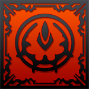

- [🏠Início](/)
- [📝Organização pré abertura do servidor RF Default!](/reunioes/05-12-2025-pre-abertura-old-times.md "Veja os tópicos que serão discutidos na reunião marcada para 05/12 às 19h.")
- Sobre a nossa Organização
  - [História da guilda](/sobredl/historia.md "Entenda tudo sobre a guilda, sua história completa que inicia lá em 2006.")
  - [Lista de Membros](/sobredl/membros.md "Veja a lista de membros da guilda, com informações sobre cada um deles.")
  - [Cenários jogados](/sobredl/cenarios.md "Veja os cenários em que a guilda atua, desde o Brasil até o Mundo.")
  - [Hierarquia de Membros & Comando](/sobredl/hierarquia.md "Veja a hierarquia e o comando da guilda, com informações sobre cada um deles.")
  - [Regras & Conduta](/sobredl/regras.md "Veja as regras e conduta da guilda, com informações sobre cada um deles.")
  - [História do Líder](/sobredl/regras.md "Entenda a história por trás do líder da guilda, desde o começo até os dias atuais.")
  - [Eventos da Guilda](/sobredl/eventos.md "Veja os eventos da guilda, com informações sobre cada um deles.")
    - [Leilão de Itens](/sobredl/eventos/leilao.md "Veja o leilão de itens da guilda, com informações sobre cada um deles.")
    - [Sorteios de Itens](/sobredl/eventos/sorteios.md "Veja os sorteios de itens da guilda, com informações sobre cada um deles.")
    - [Divisão de moeda do jogo](/sobredl/eventos/divisao-moeda.md "Veja a divisão de moeda do jogo, com informações sobre cada um deles.")

- Default - Conhecimentos
  - [Informações Gerais](/default/infos.md "Informações gerais sobre o servidor RF Default.")

- Conhecimentos Básicos RF Online
  - [Instalação & Configuração](/baserf/instalacao.md)
  - [Resolvendo possíveis Erros](/baserf/resolvendo-erros.md)
  - [Conheça os programas utilizados](/baserf/programas-utilizados.md)

- 🗺️ Conhecimentos Avançados RF Online
  - 🛡️ Raças & Classes
    - Accretia
      - [Visão Geral](/avancado/racas/accretia/visao-geral.md)
      - [Classes](/avancado/racas/accretia/classes.md)
      - [Builds Recomendadas](/avancado/racas/accretia/builds.md)
      - [Quest's Npc's](/avancado/racas/accretia/quests-npc.md)
      - [Quest's Gerais](/avancado/racas/accretia/quests-gerais.md)
    - Bellato
      - [Visão Geral](/avancado/racas/bellato/visao-geral.md)
      - [Classes](/avancado/racas/bellato/classes.md)
      - [Builds Recomendadas](/avancado/racas/bellato/builds.md)
      - [Quest's Npc's](/avancado/racas/bellato/quests-npc.md)
      - [Quest's Gerais](/avancado/racas/bellato/quests-gerais.md)
    - Cora
      - [Visão Geral](/avancado/racas/cora/visao-geral.md)
      - [Classes](/avancado/racas/cora/classes.md)
      - [Builds Recomendadas](/avancado/racas/cora/builds.md)
      - [Quest's Npc's](/avancado/racas/cora/quests-npc.md)
      - [Quest's Gerais](/avancado/racas/cora/quests-gerais.md)
  - [⚔️Chip War](/avancado/chip-war.md)
