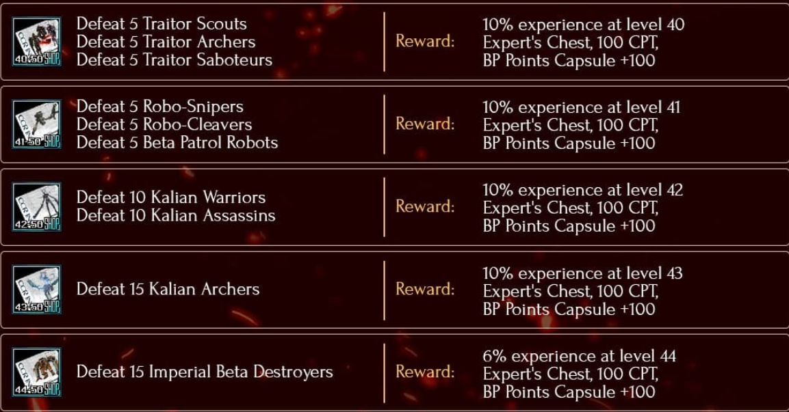
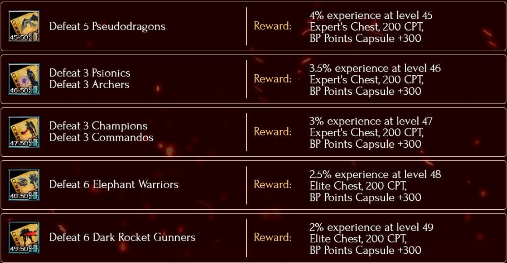
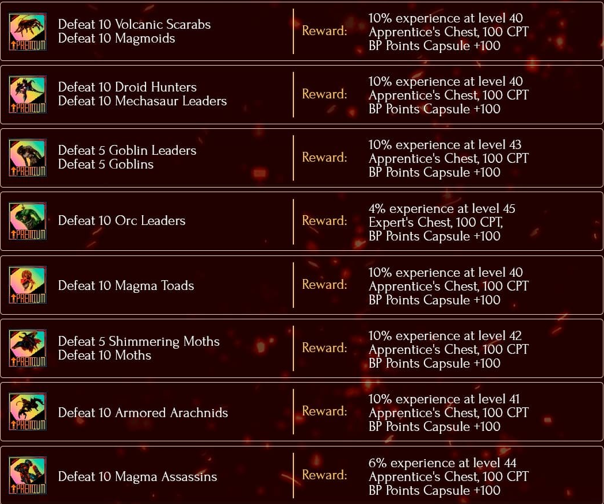
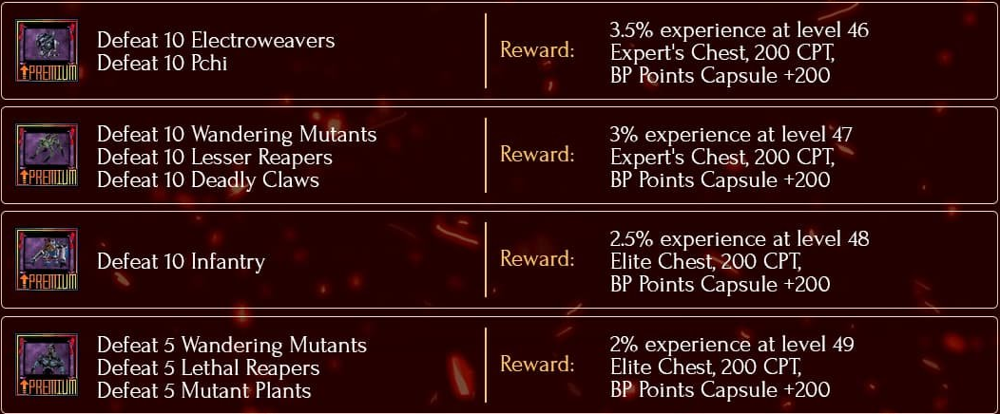
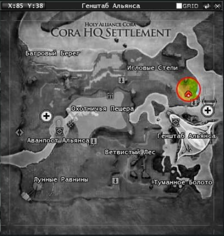
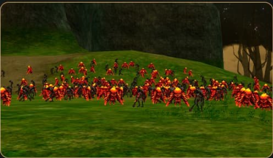
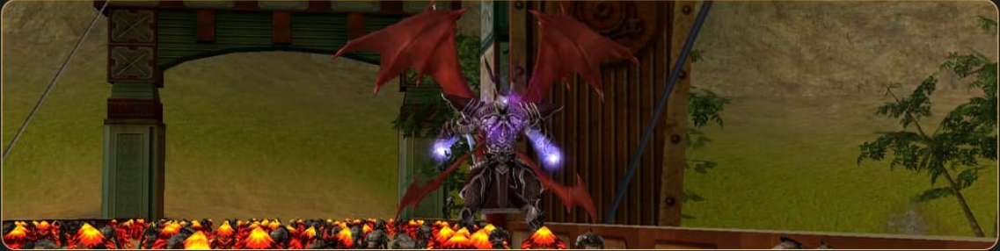
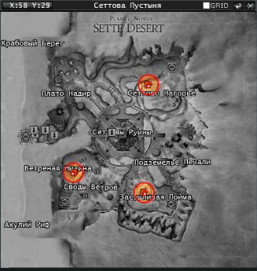

# ⚔️ CENTRAL DE PROGRESSÃO: QUESTS & PORTAIS

---

Bem-vindo ao guia definitivo de evolução e suprimentos do servidor. Esta página foi projetada para ser o ponto de referência central para todos os membros da guilda que buscam otimizar seu personagem, detalhando onde obter os itens de elite e como navegar pelo sistema de missões.

Nesta seção, você encontrará informações detalhadas sobre:

### 🌀 Sistemas de Portais

O caminho mais rápido para fortalecer seu arsenal. Os portais do servidor são a fonte primária para:

* **Armamento:** Armas Type C rebaixadas, armas Type A e as raras **Relic Weapon Boxes**.
* **Defesa:** Shields Type A, além de conjuntos completos de Armaduras Type A e Type B.
* **Upgrades & Materiais:** T2, T4, Talic Crystals, Talics diversos e o cobiçado **T5.5 Stone Converter**.
* **Suprimentos de Pontos:** Boxes com BP Capsules, Citadel Jewel Boxes e caixas aleatórias de armas e armaduras (Lv 50/55).

### 📜 Cadeias de Quests (Questlines)

Um guia completo sobre as missões disponíveis, desde o nivelamento inicial até os desafios de endgame. As tabelas de recompensas detalham cada ganho essencial, como:

* **Evolução:** Porcentagens de Experiência (EXP) otimizadas para destravar níveis.
* **Soberania:** Acúmulo de Contribution Points (CPT) para o ranking da raça.
* **Baús de Elite:** Localização de Expert's Chests, Elite Chests e BP Capsules bônus.

---

<b>Informações sobre Quest's</b>

<b>Quest's de NPC's</b>

<b>NOVIAN EXPEDITION QUESTS</b>

> "É necessário combinar a quest no NPC Hero (o representante da raça) e escolher a quest desejada."

Se tornam acessíveis a partir do nível 40, cada quest tem um cooldown de 16 horas.

<b>EPSILON EXPEDITION QUESTS</b>

> "É necessário combinar a quest no NPC Hero (o representante da raça) e escolher a quest desejada."
Se tornam acessíveis a partir do nível 45, cada quest tem um cooldown de 16 horas.

<b>PREMIUM MERCHANT QUESTS</b>

> "As quest's são compradas e aceitas no NPC Premium (hq), cada quest tem 16h de cooldown."

As quest's são feitas em grupo, exceto as Cultist Quest's, que são feitas sozinho.

<b>CULTIST QUEST'S - LEVELING SEQUENCIAL</b>

<b>CULTEST 45-46</b>

| Passo | Objetivos (Monstros) | Recompensas |
| :---: | :--- | :--- |
| **1** | 5 Magma Toads, 3 Droid Hunters, 3 Mechasaur Leaders | 2% experience at level 45 + 100 CPT + BP Points Capsule +300 |
| **2** | 5 Volcanic Scarabs, 3 Magmoids, 3 Armored Arachnids | 2% experience at level 45 + 100 CPT + BP Points Capsule +300 |
| **3** | 5 Moths, 5 Shimmering Moths | 2% experience at level 45 + 100 CPT + Random Gem or Rune Box (choice) |
| **4** | 5 Goblins, 5 Goblin Leaders, 3 Magma Assassins | 2% experience at level 45 + Expert's Chest + 100 CPT + BP Points Capsule +500 |

<b>CULTEST 46-47</b>

| Passo | Objetivos (Monstros) | Recompensas |
| :---: | :--- | :--- |
| **1** | 5 Volcanic Scarabs, 3 Magmoids, 3 Armored Arachnids | 1.4% experience at level 46 + 100 CPT + BP Points Capsule +300 |
| **2** | 5 Moths, 5 Shimmering Moths | 1.4% experience at level 46 + 100 CPT + BP Points Capsule +300 |
| **3** | 5 Goblins, 5 Goblin Leaders, 3 Magma Assassins | 1.4% experience at level 46 + 100 CPT + BP Points Capsule +300 |
| **4** | 1 Giant Orc, 1 Orc Leader | 1.4% experience at level 46 + 100 CPT + Random Gem or Rune Box (choice) |
| **5** | 3 Red Pseudodragons | 1.4% experience at level 46 + Expert's Chest + 100 CPT + BP Points Capsule +500 |

<b>CULTEST 47-48</b>

| Passo | Objetivos (Monstros) | Recompensas |
| :---: | :--- | :--- |
| **1** | 3 Pseudodragon Hatchlings, 3 Pseudodragons | 1% experience at level 47 + 100 CPT + BP Points Capsule +300 |
| **2** | 1 Renegade Saboteur, 1 Renegade Mage, 1 Renegade Deserter | 1% experience at level 47 + 100 CPT + BP Points Capsule +300 |
| **3** | 1 Renegade Observer, 1 Renegade Mercenary, 1 Renegade Warlock | 1% experience at level 47 + 100 CPT + BP Points Capsule +300 |
| **4** | 5 Pchi, 5 Electroweavers | 1% experience at level 47 + 100 CPT + BP Points Capsule +300 |
| **5** | 3 Wandering Mutants, 3 Deadly Claws, 3 Lesser Reapers | 1% experience at level 47 + 100 CPT + Keen Talic or 9 Shards of the Aborigine Crystal Talic (choice) |
| **6** | 3 Infantry Soldiers, 3 Plateau Controllers | 1% experience at level 47 + Expert's Chest + 100 CPT + BP Points Capsule +300 |

<b>CULTEST 48-50</b>

| Passo | Objetivos (Monstros) | Recompensas |
| :---: | :--- | :--- |
| **1** | Defeat 3 Renegade Deserters, Defeat 3 Renegade Warlocks | 0.7% experience at level 48 + 100 CPT + BP Points Capsule +300 |
| **2** | Defeat 3 Renegade Death Knights, Defeat 3 Renegade Landsknechts, Defeat 3 Renegade Defenders | 0.7% experience at level 48 + 100 CPT + BP Points Capsule +300 |
| **3** | Defeat 3 Robo-Gunners, Defeat 3 Robo-Swordsmen, Defeat 1 Gamma Patrol Robot | 0.7% experience at level 48 + 100 CPT + BP Points Capsule +300 |
| **4** | Defeat 1 Renegade Phantom, Defeat 1 Renegade Medium, Defeat 1 Renegade Preacher | 0.7% experience at level 48 + 100 CPT + BP Points Capsule +300 |
| **5** | Defeat 3 Infantry Soldiers, Defeat 3 Plateau Controllers | 0.7% experience at level 48 + 100 CPT + BP Points Capsule +300 |
| **6** | Defeat 3 King of the Wandering Mutants, Defeat 3 Mutant Plants, Defeat 3 Deadly Reapers | 0.7% experience at level 48 + 100 CPT + Random Gem or Rune Box (choice) |
| **7** | Defeat 1 Mercenary Thor, Defeat 3 Dark Rocket Gunners | 0.7% experience at level 48 + Elite Chest + 100 CPT + BP Points Capsule +300 |

<b>CULTEST 49-50</b>

| Passo | Objetivos (Monstros) | Recompensas |
| :---: | :--- | :--- |
| **1** | 3 King of the Wandering Mutants, 3 Mutant Plants, 3 Deadly Reapers | 0.5% experience at level 49 + 100 CPT + BP Points Capsule +300 |
| **2** | 1 Mercenary Thor, 3 Dark Rocket Gunners | 0.5% experience at level 49 + 100 CPT + BP Points Capsule +300 |
| **3** | 1 Renegade Guardian, 1 Renegade Assault Trooper, 1 Renegade Berserker | 0.5% experience at level 49 + 100 CPT + BP Points Capsule +300 |
| **4** | 1 Arachna, 1 Spiked Arachna, 1 Mature Swamp Arachna | 0.5% experience at level 49 + 100 CPT + BP Points Capsule +300 |
| **5** | 1 Renegade Templar, 1 Renegade Dark Priest, 1 Renegade Miracle Worker | 0.5% experience at level 49 + 100 CPT + BP Points Capsule +300 |
| **6** | 1 Radiant Dvulik, 1 Rii Destroyer | 0.5% experience at level 49 + 100 CPT + BP Points Capsule +300 |
| **7** | 5 Robo-Killers, 5 Delta Patrol Robots, 3 Imperial Ksi Destroyers | 0.5% experience at level 49 + Random Gem or Rune Box (choice) |
| **8** | 1 Stone Warrior, 1 Destroyer | 0.5% experience at level 49 + Elite Chest + 100 CPT + BP Points Capsule +300 |

---

<b>Quest de Evento "Invasion" - Delay 6 dias</b>

### Quest 1: «The Smoldering Hotbed of Invasion»

* **Tipo de quest:** Grupo (Group)
* **Onde pegar:** No **PVP-award merchant** (Mercador de prêmios PVP).
* **Requisito:** Nível 45.
* **Quest rollback (Cooldown):** 6 dias (após completar, você só pode repetir após esse período).
* **Objetivo:** Matar 5 **Lava flow** (Cora HQ) as 13:30 (horário de Brasilia).
* **Recompensa:** **capsule of 3000 PVP points** + **1.5k CPT**.

---

### Quest 2: «The scorcher is on the rise»

* **Tipo de quest:** Grupo (Group)
* **Onde pegar:** No **PVP-award merchant** (Mercador de prêmios PVP).
* **Requisito:** Nível 50.
* **Quest rollback (Cooldown):** 6 dias.
* **Objetivo:** Matar 5 **Ashes of Mut**.
* **Recompensa:** **capsule of 7000 PVP points** + **7k CPT**.

---

 
 
---

### BONUS - O Boss Lord Of Ashes também pode ser encontrado nas areas de respawn.

 
Respawn: **Todo dia as 13:40**.
Loot: **Capsulas de 500 pvp points**.

---

<b>Quest de Evento "The Siege" - Delay 24h</b>

| Quest | Tipo | Requisito | Objetivo | Recompensa |
| --- | --- | --- | --- | --- |
| **The Siege of Sette Desert** | Solo | Nível 40 | Matar um dos defensores do portal, pegar o token e levar ao mercador de prêmios PVP | Cápsula de 3000 pontos de PVP |

---

### **Detalhes Importantes da Quest:**

* **Onde pegar:** Mercador de prêmios PVP (PVP-award merchant).
* **Tempo de Cooldown (Rollback):** 22 horas.
* **Tempo para conclusão:** A quest falha após 1 hora se não for completada.

### **Informações sobre a quest:**

* **Onde pegar:** Matar: Cora Psi Codex, Acc Tech Guardian e Bellato Guardian.
* **Localização dos mobs:**

 

---

<b>Questline para Destravar Experiência (EXP)</b>

| Quest | Tipo | Objetivo / Ação | Localização |
| --- | --- | --- | --- |
| **Printout** | Solo | Falar com o líder da raça | HQ |
| **The Hustle** | Solo | Falar com o NPC (Miscellaneous) | Elan |
| **Meat Grinder** | Solo | Matar Calianas Archer | Ether |
| **Gathering resources** | Solo | Falar com o NPC Foreign Vendor | Ether |
| **Gathering resources** | Solo | Coletar 500 Gli (mais rápido em Caliana) | Ether / Caliana |
| **Serious Conversation** | Solo | Falar com o NPC Portal Guide | Sette |
| **Warm-up** | Solo | Coletar 5 itens de quest (Volite) e 5 (Infernal Lava) | Calderon |
| **Preparation** | Solo | Falar com o NPC Foreign Vendor | Elan |
| **Checking out** | Solo | Matar 'Baby Pseudodragon' (Coletar item do Draco) | Elan |
| **Strength Test** | Solo | Falar com o NPC "The Sword in the Stone" | Elan Encontrar |
| **Proof** | Solo | Coletar 5 itens (Infernal Grumble e Heavy Squad) | Calderon |
| **Proof** | Grupo | Coletar 5 itens (Ash / Burn Ash) | Calderon |
| **Proof** | Grupo | Coletar 3 itens (Great Curr e Giant Baba) | Caverna de Calderon |
| **Pooof** | Grupo | Coletar 3 itens (Granito Block) | Calderon |
| **Proof** | Solo | Coletar 1 item (Infernal Draco) | Calderon |
| **Legend** | Solo | Conversar com o NPC Race Manager | HQ |
| **Final** | Grupo | Coletar Blood, Destruction e Soul do Cubo Precioso | Dentro de Calderon |

---

<b>Lista de Quests por Monstros</b>

> Passe o mouse sobre a lupa 🔍 para visualizar o mapa com as localizações dos monstros.

---

    
<b>Informações sobre os Portais</b>

Clique aqui e veja o conteudo completo: [Portais](https://forum.rf-default.com/index.php?/topic/10406-dungeon/)

