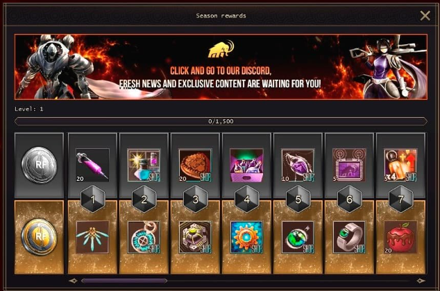

<b>Regras e informações da guilda no servidor RF Default RPG</b>

* **Raça:** Cora.
* **Comunicação:** TeamSpeak (id: dlguild), discord como secundário (https://discord.gg/8xf4z9aEy3).
* **Regras:** Já fazem {yearsPassed} anos que nossa organização é sólida e bem estabelecida, base disso é que seguimos as mesmas simples regras durante todo o tempo.
* **Distribuição de items:** Tudo de valor que a guilda obter será distribuido entre os membros de forma justa, para isso contamos com o sistema de pontos. Para mais informações clique [aqui](/sobredl/eventos/leilao.md).

<b>Informações básicas do servidor RF Default.</b>

### ⚔️ Informações Essenciais (Rates & Level)

* **Abertura:** 14 de Fevereiro.
* **Level Cap:** 50 (com **barreira no lv45** que exige quest para avançar).
* **Rates:** x2 (EXP, Animus, PT e Skill) | Drops x1.
* **Janelas:** 1 sem premium / 2 com premium.
* **PvP Limit:** 10.000 + 1.000 por level.

---

### 💎 Vantagens Premium & Sistema VIP

* **Autoloot:** Exclusivo para usuários Premium (desativado para torres abaixo do nível 45).
* **Diferencial:** Espada de uma mão usável enquanto corre.
* **Quests:** Acesso a missões exclusivas e Battle Pass.
* **Preço:** 7 reais 7 dias, 30 reais 30 dias, 60 reais 90 dias (mais recomendado).

---

### 🛠️ Sistemas de Craft e Economia

* **Profissões:** Mineração, Herborista ou Lenhador (escolha 1 no lv30).
* **Recursos:** Uso de ferramentas (Machado, Picareta, Foice, Arpão) para coleta.
* **Craft:** Armaduras INT 45-50 podem resultar em itens **P.A.L.M.A.S**.
* **Leilão Inter-racial:** Disponível para itens de raça e Cash Shop.
* **Cash Shop in-game:** Vendedores vendem cápsulas de Cash por moeda do jogo.

---

### 🗺️ Mapas e Progressão

* **Sette Desert:** Porto de pesca e loot estático (lugar novo)(não reduz por level).
* **Elan:** Mapa interconectado, cheio de novas passagens.
* **Dungeons:** Até level 50, incluindo a nova "Brotherhood World".
* **Bônus Online:** 1 hora logado = Bolo de EXP + 7 Mamont-points (gastos em NPC especial).

---

### ⚖️ Equilíbrio de Raças e PvP

* **Bônus de Classe:** Guerreiros ganham +50% EXP; Classes de Ataque +35% EXP.
* **Cora:** Bug de magia corrigido (igual para ambos os gêneros).
* **Bellato:** MAU não recebe experiência.
* **Accretia:** Lançadores lv45 ganham "Precipitation" (permite 2 skills) em Elan.
* **Regras de Voto:** Lv45 + 30k Status + 1000 min online + Cédula de Voto (3.8M).
* **Anti-Cheat:** Proibido farmar PvP em "twinks" (personagens secundários) sob pena de banimento.

<b>Runes Gems e Stones</b>

- Runas e Gemas
- Existem 3 tipos de Stones.
- Colored – Tem 1 a 3 propriedades e 4 grades.  (Adiciona ao Set). Consegue Craftando.
- Gem – Tem 2 propriedades e 5 grades. (Adiciona a Elem e JetPack). Consegue nos Mobs Ether e DQs.
- Runestone – Tem 1 propriedade e 1 grade.  (Adiciona a Arma e Shield). Consegue nos Mobs Lendários e DQs.

Este conteudo sera é algo que cada um vai ter que dedicar um tempo a mais para entender e aprender, é algo simples mas demanda atenção.

Clique aqui e veja o conteudo completo: [Runes Gems e Stones](https://forum.rf-default.com/index.php?/topic/8896-runes-gems-and-stones/)

<b>📦 Agrupamento de Items.</b>

### 📦 Guia Rápido: Caixas de Recursos

**Custo:** Cada pack de caixa vazia custa 100k disena.
**O que é isso:** Você pode empacotar os itens que são agrupaveis em 1 único slot. Exemplo, eu tenho 3 packs de minérios. Segura ctrl e mantem, clica na box e clica no item que você quer.
Ou seja, 99 box vazias, você consegue agrupar até 99 packs de Gli ou outros items. Assim estocando.

**Comandos:**

* **Empacotar:** Selecione a Caixa (Botão Esquerdo) ➔ **ALT + Botão Direito** no item.
* **Desempacotar:** **Botão Direito** na Caixa.
* **Combinação Rápida (Pular NPC Hero):** **CTRL + ALT + Botão Direito** no item (o custo da combinação ainda se aplica).

**Itens Compatíveis:**

* Minérios (+1 a +3), Talics, Pedras (T1-T4, Red/Blue), Fragmentos de Excelsior e Cubos.

<b>Informações sobre o Battle Pass do servidor RF Default.</b>

### **O Essencial do Battle Pass**

* **O que é:** É um conteúdo adicional - Um sistema baseado em níveis que recompensa o jogador com itens do jogo for completar quest's.
* **Como progredir:** Você sobe de nível usando **capsulas BP**. Elas são obtidas em: **Story Quests**, **Tarefas repetitivas** e **comprando diretamente**.

Pode ser acessado pelo icone do mamute no topo esquerdo da tela.

* **BP Free vs Pago**: Você pode de maneira gratuita receber as recompensas, entretanto caso você opte por comprar o BP Pago, ele tem um linha de baixo com itens exclusivos atém de que ele dá um bonus de +20% de experiência em todas as capsulas BP, fazendo você completar o passe muito mais rápido.

