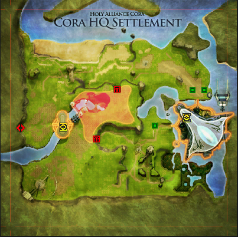

# 📍 Exemplo Prático - Coordenadas Exatas

**Como funciona o posicionamento em pixels**

---

## 🎯 Explicação do Sistema

As coordenadas na coluna D da planilha são **posições EXATAS em pixels** da imagem do mapa.

### Exemplo do usuário:
```
Quest: 2
Nome: Travel Bag
Coordenadas: 69,145
```

**Significa:**
- Marcador aparece no **pixel X=69, Y=145** da imagem
- X = distância da esquerda (69 pixels)
- Y = distância do topo (145 pixels)

---

## 📐 Como o Sistema Funciona

### Estrutura HTML Renderizada:
```html
<div class="map-container" style="position: relative;">
  
  
  <div class="markers" style="position: absolute; top: 0; left: 0;">
    
  </div>
</div>
```

### CSS Aplicado:
```css
.quest-mob-marker {
  position: absolute;
  width: 24px;
  height: 24px;
  transform: translate(-50%, -50%); /* Centraliza no ponto */
}
```

O `transform: translate(-50%, -50%)` centraliza o ícone de 24x24px no ponto exato.

---

## 📊 Exemplo Completo na Planilha

### Cenário: Mapa Cora HQ com 3 spawns

**Planilha Google Sheets:**
```
┌────┬──────────────┬─────────┬──────────────────────┐
│ A  │      B       │    C    │          D           │
├────┼──────────────┼─────────┼──────────────────────┤
│ 2  │ Travel Bag   │ cora_hq │ 69,145               │
│ 3  │ Hunt Goblins │ cora_hq │ 120,200;180,250      │
│ 4  │ Boss Quest   │ cora_hq │ 300,100              │
└────┴──────────────┴─────────┴──────────────────────┘
```

### Resultado no Site:

**Quest #2 - Travel Bag:**
- 1 marcador no pixel (69, 145)

**Quest #3 - Hunt Goblins:**
- 2 marcadores:
  - Marcador 1: pixel (120, 200)
  - Marcador 2: pixel (180, 250)

**Quest #4 - Boss Quest:**
- 1 marcador no pixel (300, 100)

---

## 🧪 Testando Posições Exatas

### Método 1: Teste Visual Rápido

1. Abra `test-quest-positioning.html`
2. Cole URL do mapa: `https://www.darklegionrf.com/docimages/maps/cora_hq.png`
3. Cole coordenadas: `69,145`
4. Clique "Plotar Marcadores"
5. **Veja se marcador está EXATAMENTE onde esperado**

### Método 2: Pegar Coordenadas Clicando

Console do navegador (F12):
```javascript
// Cole este código no console
document.querySelector('img').addEventListener('click', function(e) {
  const rect = this.getBoundingClientRect();
  const x = Math.round(e.clientX - rect.left);
  const y = Math.round(e.clientY - rect.top);
  
  console.log(`Coordenada: ${x},${y}`);
  navigator.clipboard.writeText(`${x},${y}`);
  
  // Mostra alert
  alert(`Copiado: ${x},${y}`);
});
```

**Depois:**
- Clique onde quer o marcador
- Coordenada é copiada automaticamente
- Cole na planilha coluna D

---

## 📏 Referência de Coordenadas

### Sistema de Eixos:
```
(0,0) ← Canto superior esquerdo
  ↓ Y aumenta para baixo
  → X aumenta para direita

Exemplo em imagem 400x400px:

(0,0)                    (400,0)
  ┌────────────────────────┐
  │                        │
  │      (200,200)         │ ← Centro
  │                        │
  └────────────────────────┘
(0,400)                 (400,400)
```

### Validação:
- Se imagem é 400x400px
- X deve estar entre 0 e 400
- Y deve estar entre 0 e 400
- Valores fora = marcador fora da imagem (não aparece)

---

## 🎨 Exemplo Visual (Baseado na Imagem Enviada)

**Mapa: Cora HQ Settlement**



### Spawns Identificados:
```
Spawn 1 (área vermelha esquerda):     69,145
Spawn 2 (área verde direita):         340,150
Spawn 3 (área amarela centro):        200,180
Spawn 4 (área verde inferior):        260,280
```

### Na Planilha:
```
Coluna D: 69,145;340,150;200,180;260,280
```

### Resultado:
- ✅ 4 marcadores vermelhos pulsando
- ✅ Cada um no local exato
- ✅ Tooltip mostra mapa com todos marcadores

---

## 💡 Dicas Importantes

### 1. Coordenadas são PIXELS, não porcentagem
```
✅ Correto:   69,145
❌ Errado:    0.17,0.36
```

### 2. Use imagem no tamanho REAL
Se testar com imagem redimensionada, coordenadas ficam erradas

### 3. Formato exato
```
✅ Correto:   69,145;120,200;180,250
❌ Errado:    (69,145);(120,200)
❌ Errado:    [69,145],[120,200]
❌ Errado:    69 145 ; 120 200
```

### 4. Espaços são OK (o script limpa)
```
✅ Aceito:    69,145  ;  120,200
✅ Aceito:    69 , 145 ; 120 , 200
```

---

## 🔍 Debugging

### Console (F12) deve mostrar:
```
📍 Posicionando 1 marcador(es): ["69,145"]
  ✅ Marcador 1: x=69px, y=145px
```

### Se aparecer:
```
⚠️ Coordenadas inválidas: "abc,def"
```
**Problema:** Não são números válidos

### Se marcador não aparece:
1. Coordenadas fora da imagem?
2. Imagem carregou? (veja console)
3. Ícone mob.png existe no servidor?

---

## ✅ Checklist Final

- [ ] Coordenadas em formato `x,y`
- [ ] Múltiplas separadas por `;`
- [ ] Valores numéricos (inteiros)
- [ ] Dentro do tamanho da imagem
- [ ] Testado com `test-quest-positioning.html`
- [ ] Marcadores aparecem nos locais corretos
- [ ] Console sem erros

---

## 🎯 Exemplo Real: Travel Bag

### Planilha:
```
A: 2
B: Travel Bag
C: cora_hq
D: 69,145
```

### O que acontece:
1. Usuário passa mouse na lupa 🔍
2. Script carrega `cora_hq.png`
3. Aguarda imagem carregar
4. Cria marcador com:
   - `left: 69px`
   - `top: 145px`
   - `transform: translate(-50%, -50%)`
5. Marcador aparece **EXATAMENTE** no pixel (69, 145)

### Console mostra:
```
📊 Carregando quests do Google Sheets...
✅ Dados de quests carregados com sucesso
✅ 1 quests parseadas da planilha
✅ Lista de quests renderizada com sucesso
📍 Posicionando 1 marcador(es): ["69,145"]
  ✅ Marcador 1: x=69px, y=145px
```

---

**Sistema implementado e funcionando corretamente!**

Use `test-quest-positioning.html` para validar cada coordenada antes de adicionar na planilha.
