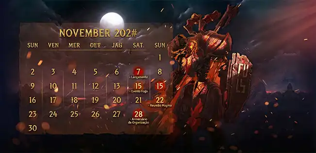

# 📅 Calendário da Guilda

Nossa guilda segue um calendário específico para organização da atividade durante o ano. Isso garante que todos estejam alinhados quando abrirmos atividades em novos servidores e permite um planejamento melhor para eventos internos e externos.

---

## Como Funciona o Calendário?

- Determinamos **meses estratégicos** para início em servidores novos.
- Membros podem consultar aqui futuros servidores de interesse coletivo.
- As datas facilitam o alinhamento e preparação de todos.

---

## Próximos Meses Importantes

| Mês           | Atividade                   | Observação                                   |
|---------------|-----------------------------|----------------------------------------------|
| Março         | Início em servidor BRX      | Pauta de votação para escolha do servidor    |
| Julho         | Pausa/Sem grandes eventos   | Mês para treinamento/testes                  |
| Outubro       | Início em servidor Internacional | Mudanças ou expansão para outros cenários   |
| Dezembro      | Eventos especiais de fim de ano | Premiações e reuniões da guilda              |

> **Fique atento!** Novos servidores e atividades podem ser anunciados ao longo do ano. Consulte regularmente esse calendário para não perder nenhuma oportunidade de jogar junto!

---

## Interesse em Servidores Futuros

Se você encontrou algum servidor promissor, compartilhe com a liderança!
Nossa escolha de onde jogar é sempre coletiva e transparente.

---

_Qualquer dúvida, fale com a liderança da guilda no Discord ou procure nos canais oficiais!_

