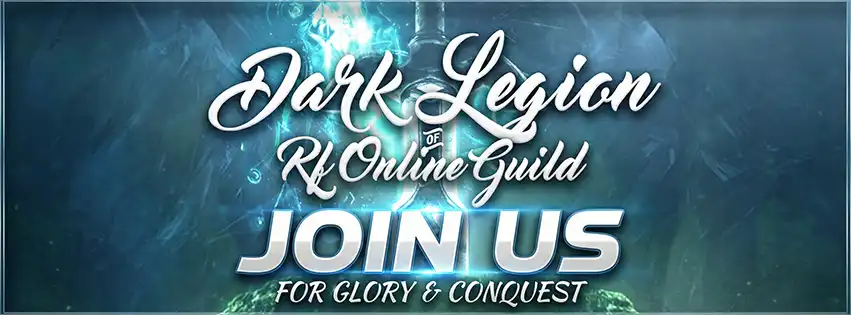
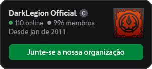

# Como Entrar na Guilda

Entrar na nossa organização é realmente simples! Siga os passos abaixo e faça parte do que chamamos de família, inicialmente você entra no discord e posteriormente temos também uma comunidade no whatsapp.

Entenda as regras e conduta da guilda para ter acesso ao Discord.
 
Pode parecer chato, mas é importante para que possamos ter um ambiente saudável para todos e desempenhar da melhor forma possível, entenda que você é muito bem vindo(a) e queremos que você se sinta à vontade.

<!-- Exibe as regras diretamente aqui abaixo do título -->

  <h3>Regras & Conduta de maneira resumida, caso pelo titulo não fique claro, clique para ver as regras completas.</h3>
  <ol style="margin-left:18px;">
    <li>
      

        
<b>Respeito acima de tudo</b>

        Mantenha o respeito com todos os membros da guilda, sem discriminação, preconceito ou provocações pessoais.
      

    </li>
    <li>
      

        
<b>Jogo limpo</b>

        Não pratique trapaças, exploits ou qualquer comportamento que vá contra as regras do servidor.
      

    </li>
    <li>
      

        
<b>Colabore sempre</b>

        Ajude os outros quando possível, mantenha comunicação e participe coletivamente das atividades propostas.
      

    </li>
    <li>
      

        
<b>Preserve o ambiente saudável</b>

        Evite discussões acaloradas em público e mantenha um clima amigável nos grupos e no Discord.
      

    </li>
    <li>
      

        
<b>Não compartilhe informações privadas</b>

        Evite expor dados pessoais ou de outros membros, em qualquer meio relacionado à guilda.
      

    </li>
  </ol>

<!-- Checkbox (após concordar, exibe o restante da página) -->

  <label style="cursor:pointer; display:flex; align-items:center; gap:8px; font-size:1.08rem;">
    <input type="checkbox" id="concordo-regras" style="width:20px; height:20px;">
    Eu concordo com as Regras & Conduta da Guilda †Dark·Legion†
  </label>

2. **CASO CONCORDE - Entre no nosso Discord**  
     Se concordar com as regras, basta acessar o nosso servidor do Discord:

     
     

       <a href="https://discord.com/invite/8xf4z9aEy3" target="_blank"><b>👉 Clique aqui para entrar no Discord</b></a>
     

  3. **Peça registro na sala `#novos-membros`**  
     Assim que estiver no Discord, localize a sala `#novos-membros` e peça seu registro para ser reconhecido(a) como membro oficial.

  4. **Aguarde a aprovação**  
     O mais breve possível, um admin irá aprovar seu registro. 
     Enquanto isso, você pode aproveitar o tempo para acessar a seção `#jogando-atualmente` e começar a criar o seu personagem para jogar conosco!

  ---

  Se tiver qualquer dúvida, pode perguntar diretamente no Discord ou falar com qualquer membro da staff. 
  Estamos ansiosos para te receber!
